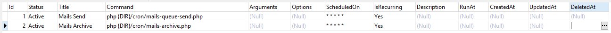

# PHP Library. Scheduler

Database driven scheduler.

## Usage ##

Create a file called scheduler.php

```php
<?php

error_reporting(E_ALL);
ini_set('display_errors', true);
ini_set('display_startup_errors', true);

require_once dirname(__DIR__) . '/vendor/autoload.php';

\Sinevia\Scheduler::configure(['pdo' => db()->getPdo()]);

(new \Sinevia\Scheduler)->run();
```

Add new entry in crontab

```sh
* * * * * php /var/www/your-project/cron/scheduler.php >> /dev/null 2>&1
```

## Helpers ##

- {DIR}

The {DIR} occurrence in a command will be substituted with the current project folder absolute path

For instance: 
php {DIR}/cron/mails-archive.php will be converted to php /var/www/your-project/cron/mails-archive.php

## Screenshots ##


